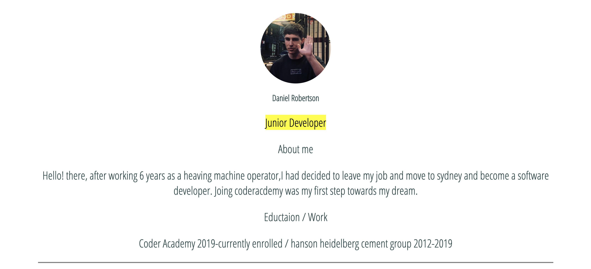
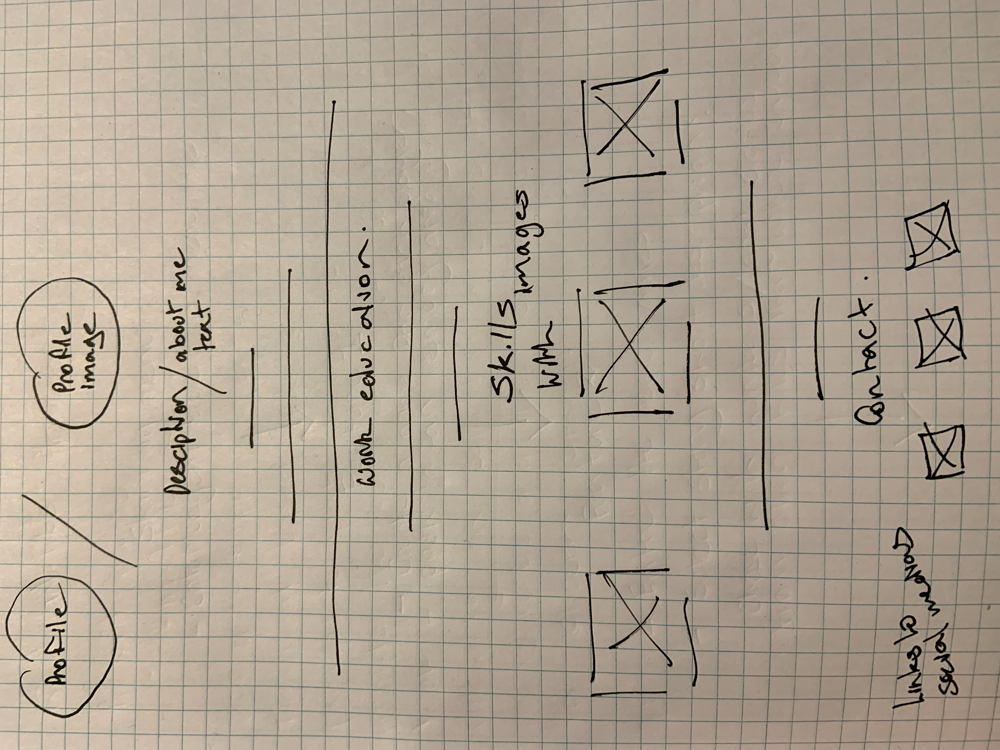

# Daniel Robertson

## Portfolio (A1-3)
Coder Academy/Gentech 2019.

------------

<!-- A link (URL) to your published portfolio website
A link to your GitHub repository
Ensure the repository (repo) is accessible by your Educators -->

### Github Link
https://github.com/dannroberts/portfolio-

### Website Link
https://daniels-portfolio.netlify.com

<!-- Description of your portfolio website, including,
Purpose
Functionality / features
Sitemap
Screenshots
Target audience
Tech stack (e.g. html, css, deployment platform, etc) -->

## Project Aim/Purpose 

Build a clean portilio, that I improve over time as my skills develop.

The site should be responsive, accessible and have a simple/minimal design. The content will include:
```
- Contact details
- Link to my Github/Linkedin/Twitter
- Info about me 
- Study/Work
```

## Intended Audience
 
Future employers, collaborators and gentech classmates

## Tech Stack

- HTML
- CSS
- Github
- Netify

## Screenshots

Here are some screens shots of:

 - Moodboarding
 - screens shot of finished website
 - Wireframes using pen/paper

My Insparation, keep it minimal


About me info


skills


Projects


Wireframe


## Project Plan & Timeline

I had planed to use Trello. but found it unnecessary for individual protfolio work

#### Monday/Tuesday

- Brainstorming 
- Create a mood board on Pinterest
- Wireframes
- Develop wireframes

#### Wednesday/Thursday/Friday

- Basic HTML structure
- Responsive Design (mobile first) 
- Applying CSS

#### Saturday/Sunday

- Documentation
- README
- Deploy
- Summit, Sunday - 17:00

## Design Process

- Keeping it as simple as possiable
- Doing 1 section at a time
- checking responsiveness 

## Short Answer Q&A


Describe key events in the development of the internet from the 1980s to today.

the 1980s,the internet was mainly used by the military. The first network intended for non-government use was called CSNET and by 1982. it connected 24 global sites (universities and other research centres). It was then that the Domain Name System was introduced, shortly followed by suffixes such as .com and .gov. In 1989, Tim Berners-Lee proposed and created a network standardization that allowed different computers on the network to access the same "websites". This was called the hypertext transfer protocol and was the beginning of the word wide web (www). In 1990, the first search engine was created and in 1993, the first web browser was released. In 1996, the first mobile phone with internet access was released by Nokia.

Define and describe the relationship between fundamental aspects of the internet such as: domains, web servers, DNS, and web browsers.

- Domains are a group of computers that can be , accessed and administered with a common set of rules.
- A web server is a system that delivers content or services to end users over the internet. A web server consists of a physical server, server operating system (OS) and software used to facilitate HTTP communication. A web server is just a internet server
- Domain Name Servers (DNS) are like phonebooks for the internet. They maintain a directory of domain names and translate them to Internet Protocol (IP) addresses.
- Web browsers are applictaions used to access websites

Reflect on one aspect of the development of internet technologies and how it has contributed to the world today.

The develpoment of social media has changed the way we use the internet and commmunicate with eachother, its now instantaneous. the world modern world wont function with out it.
