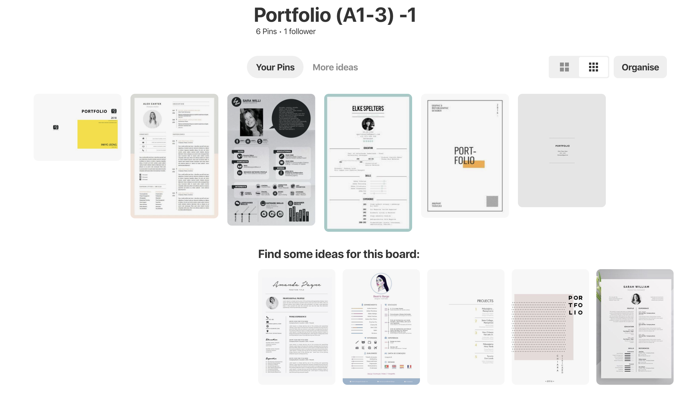
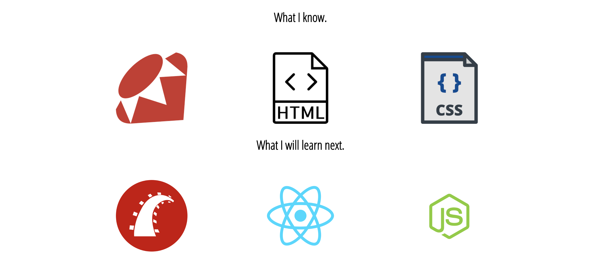

# Daniel Robertson

## Portfolio (A1-3)
Coder Academy/Gentech 2019.

------------

<!-- A link (URL) to your published portfolio website
A link to your GitHub repository
Ensure the repository (repo) is accessible by your Educators -->

### Github Link
https://github.com/dannroberts/portfolio-

### Website Link
https://daniels-portfolio.netlify.com

<!-- Description of your portfolio website, including,
Purpose
Functionality / features
Sitemap
Screenshots
Target audience
Tech stack (e.g. html, css, deployment platform, etc) -->

## Project Aim/Purpose 

Build a clean portilio, that I improve over time as my skills develop.

The site should be responsive, accessible and have a simple/minimal design. The content will include:
```
- Contact details
- Link to my Github/Linkedin/Twitter
- Info about me 
- Study/Work
```

## Intended Audience
 
Future employers, collaborators and gentech classmates

## Tech Stack

- HTML
- CSS
- Github
- Netify

## Screenshots

Here are some screens shots of:

 - Moodboarding
 - screens shot of finished website
 - Wireframes using pen/paper

My Insparation, keep it minimal


About me info


skills


Projects
